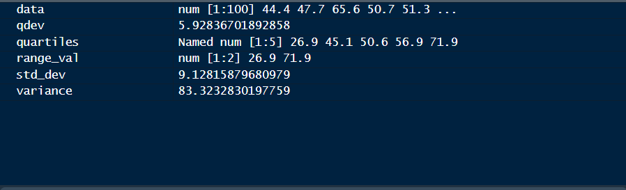
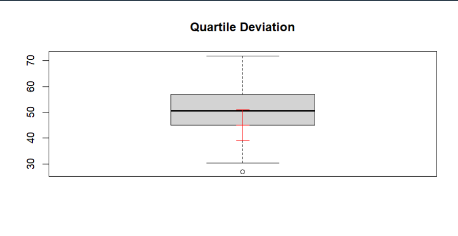
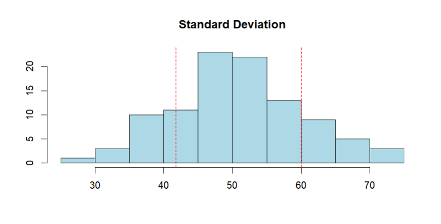
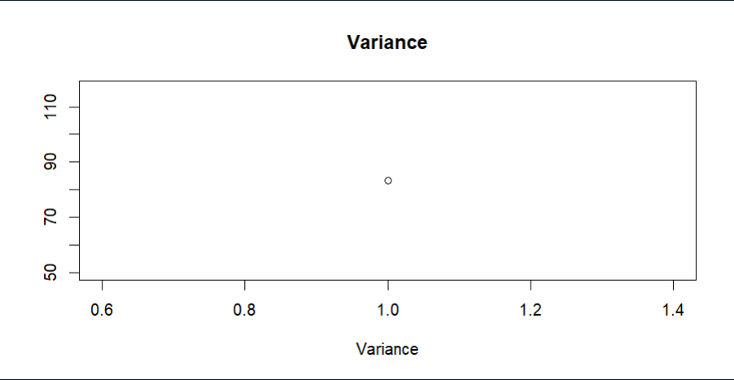

# Aim: 
To utilize R's visualization capabilities for the graphical representation of measures of dispersion, including Range, Quartile Deviation, Standard Deviation, and Variance, in a given dataset.

# Introduction: 

Measures of dispersion provide insights into the spread or variability of a dataset. In this practical, we will leverage R's powerful visualization capabilities to graphically represent measures of dispersion, including the range, quartile deviation, standard deviation, and variance. Visualizations enhance our understanding of the spread of data and facilitate comparisons between different datasets.

# Objective: 
The main objectives of this practical are:

- Calculate measures of dispersion using R functions.
- Utilize R's visualization tools to graphically represent the range, quartile deviation, standard deviation, and variance.
- Interpret and analyze the visualizations to gain insights into the spread of the dataset.

# Output:

## Data: 

## Quartile Deviation

## Standard Deviation

## Variance
