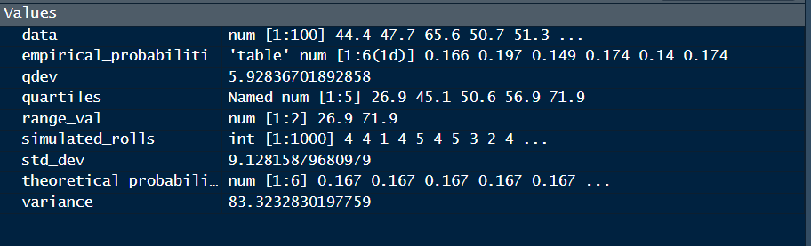
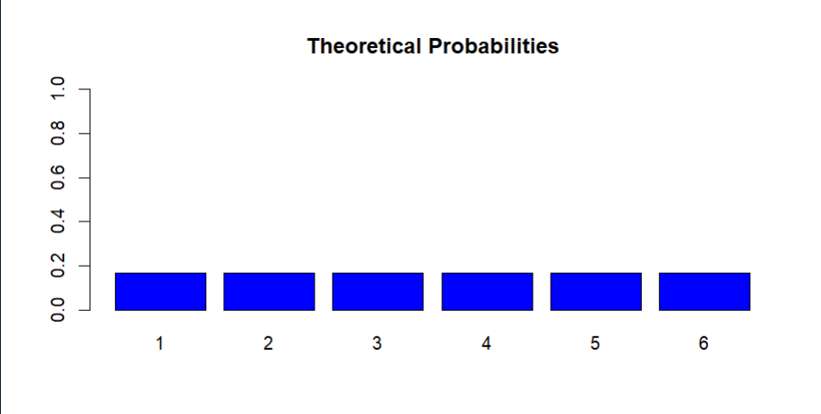
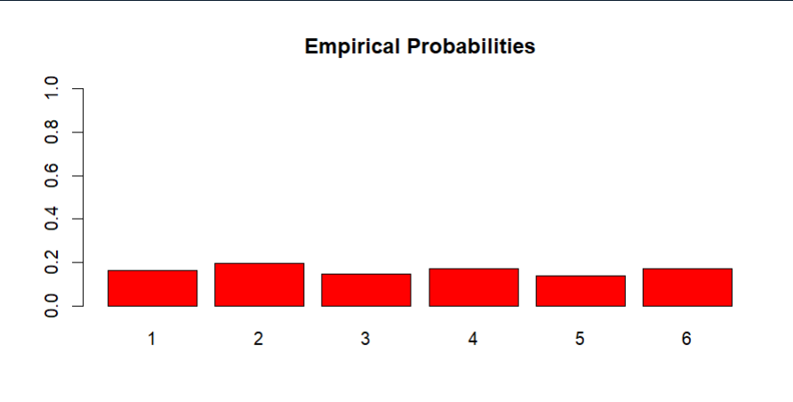

# Aim
Employ R to use random number generation and simulations to verify theoretical probabilities.

# Introduction
Probability theory plays a crucial role in understanding and predicting uncertain events. In this practical, we will leverage the power of R to explore theoretical probabilities through random number generation and simulations. By comparing the results obtained through simulation with the expected theoretical probabilities, we aim to gain insights into the practical applications of probability theory.

# Objectives
The main objectives of this practical are:

1. Understand theoretical probabilities for simple events.
2. Utilize R to generate random numbers and simulate events.
3. Compare simulated probabilities with theoretical probabilities to validate results.

# Materials
1. RStudio or R environment installed.
2. Basic knowledge of probability theory.

# Outputs
### Data

### Theoritical Probability

### Empirical Probability
