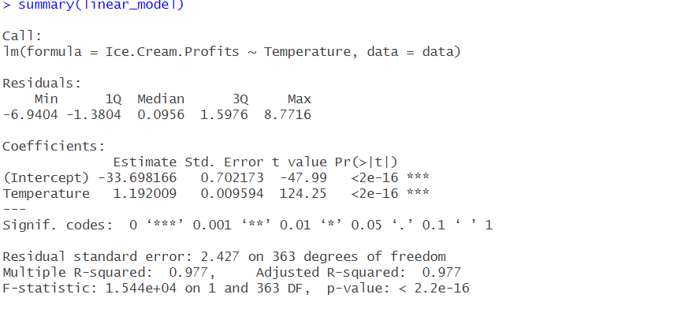
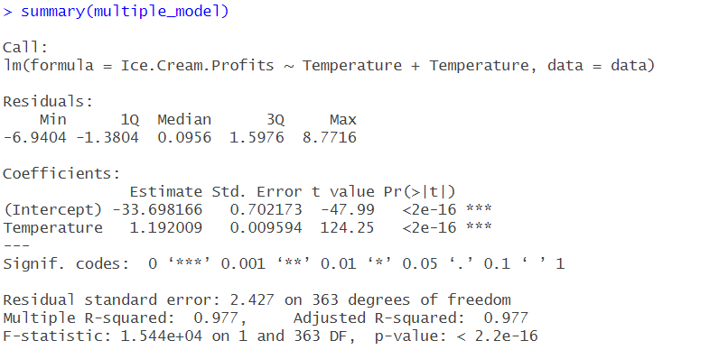
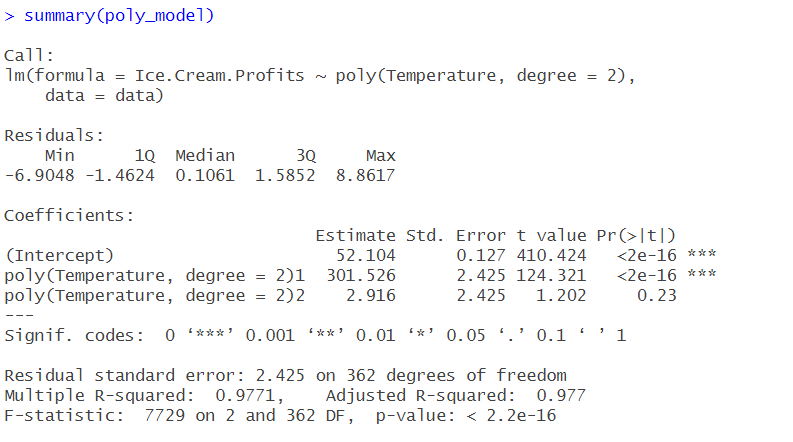
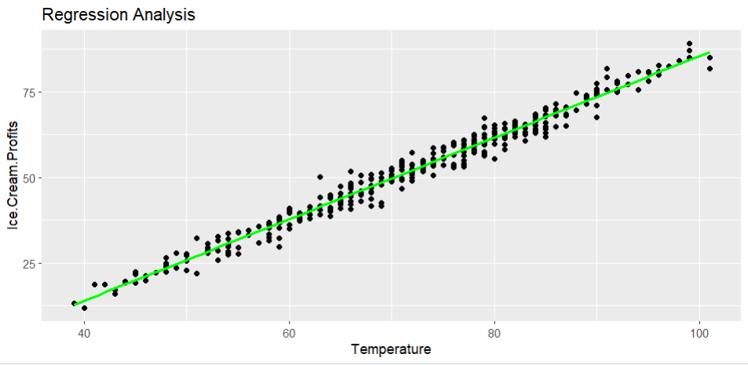

# Aim

Perform a comprehensive regression analysis using R, exploring various methods such as linear regression, multiple regression, and polynomial regression.

# Introduction

The aim of this experiment is to perform a comprehensive regression analysis using R, exploring various regression methods including linear regression, multiple regression, and polynomial regression. The goal is to understand the application of regression analysis in predicting and modeling relationships between variables.

# Software Required

- R 4.8.6
- RStudio

# Relevance of Experiment

Regression analysis is a fundamental statistical technique used in various fields for predicting relationships between dependent and independent variables. Understanding different regression methods helps in selecting the most suitable model for a given dataset. This experiment is relevant for data analysts, statisticians, and researchers who need to analyze and interpret relationships in their data.

# Description

The experiment involves loading a dataset, exploring its structure, and applying various regression techniques in R. The dataset may contain multiple variables, allowing for the exploration of relationships between them. Participants will learn how to perform linear regression, multiple regression, and polynomial regression, interpret the results, and assess the model's performance.

# Outputs
### Linear Regression Model

### Multiple Regression Model

### Poly Regression Model

### Linear Regression Representation
