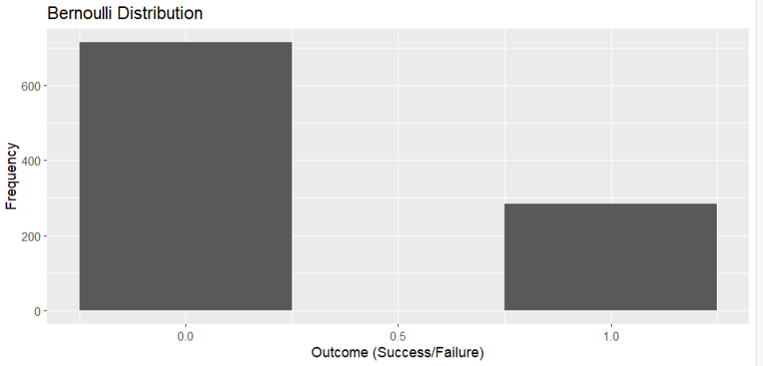
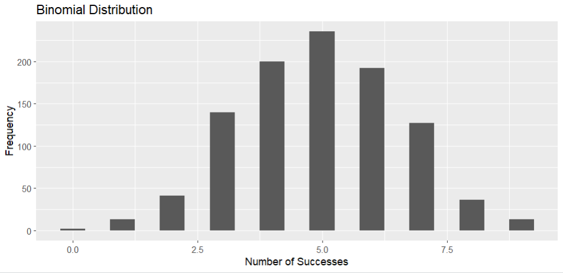
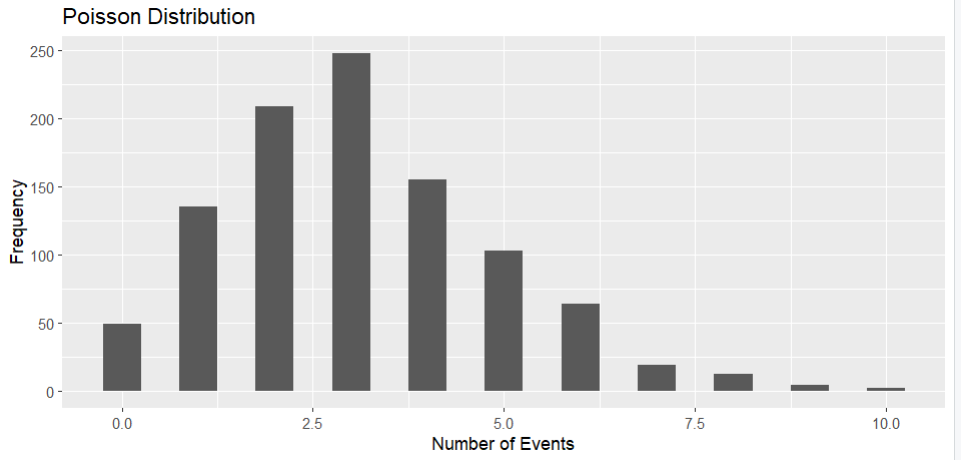

# Aim

Simulate and analyze discrete probability distributions, focusing on Bernoulli, Binomial, and Poisson distributions using R.

# Introduction

The aim of this experiment is to simulate and analyze discrete probability distributions, with a specific focus on the Bernoulli, Binomial, and Poisson distributions, using the R programming language. The primary goal is to understand the principles of these distributions, simulate random variables, and analyze their properties.

# Software Required

- R 4.8.6
- RStudio

# Relevance of Experiment
Understanding and simulating discrete probability distributions is fundamental in various fields such as statistics, data analysis, and operations research. This experiment is relevant for individuals who need to model and analyze scenarios where outcomes are discrete and probabilistic. It provides essential skills for handling randomness and making informed decisions based on probability distributions.

# Description
The experiment begins with a brief overview of the Bernoulli, Binomial, and Poisson distributions. Participants will then learn to simulate random variables from these distributions, calculate probabilities, and analyze the properties of each distribution. Emphasis will be placed on understanding the parameters that govern each distribution and how they influence the shape and characteristics of the distribution.

### Bernoulli Distribution

### Binomial Distribution

### Poisson Distribution
