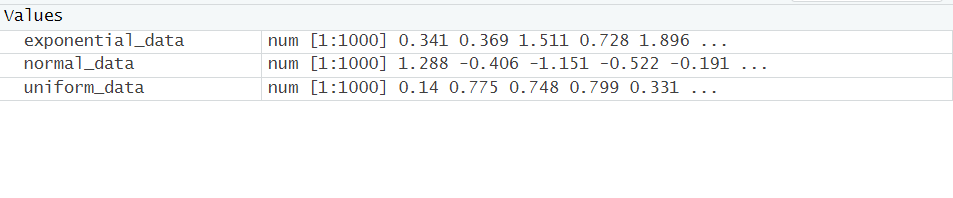
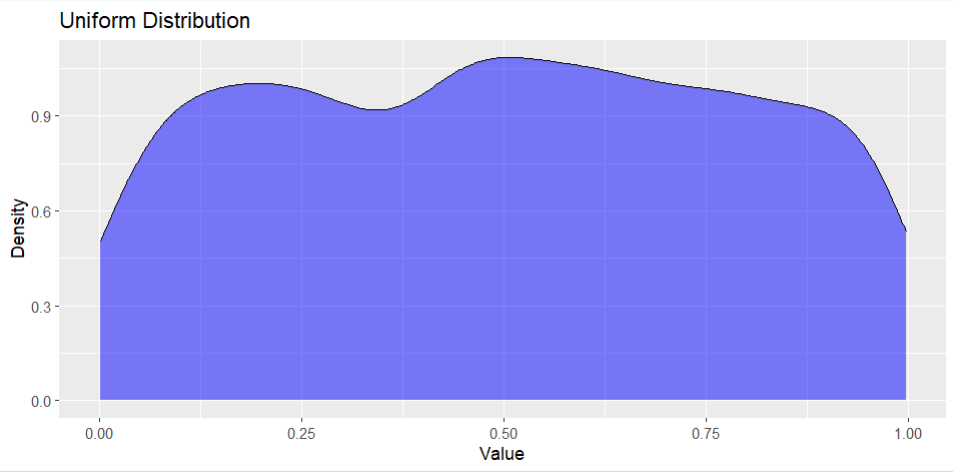
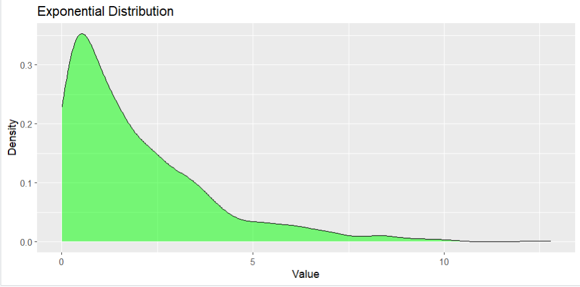
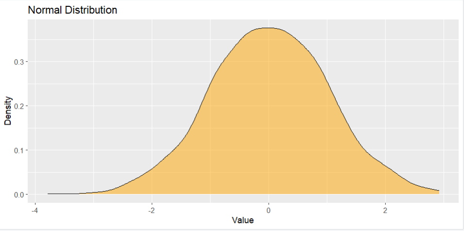

# Aim

Visualize continuous probability distributions, specifically Uniform, Exponential, and Normal distributions, with a focus on the properties of the normal distribution and area under the normal curve using R.

# Introduction

The aim of this experiment is to visualize continuous probability distributions, specifically the Uniform, Exponential, and Normal distributions, with a particular focus on understanding the properties of the Normal distribution and calculating the area under the normal curve using the R programming language.

# Software Required

- R 4.8.6
- RStudio

# Relevance of the Experiment

Understanding continuous probability distributions is crucial in statistical analysis and data science. This experiment is relevant for individuals who need to model and visualize continuous random variables, with a special emphasis on the widely used Normal distribution. Knowledge of these distributions is fundamental for making statistical inferences and understanding the characteristics of datasets.

# Description

The experiment begins with a brief overview of the Uniform, Exponential, and Normal distributions. Participants will learn to generate random samples from each distribution, create probability density functions (PDFs), and visualize the distributions. Special attention will be given to the properties of the Normal distribution, including the concept of standardization and the calculation of probabilities using the area under the normal curve.

# Outputs

### Data Values

### Uniform Distribution

### Exponential Distribution

### Normal Distribution

